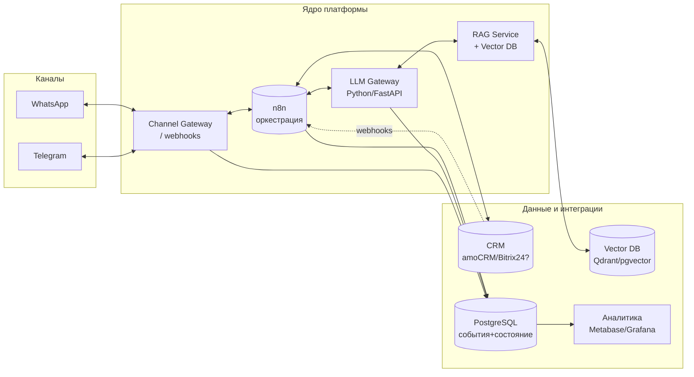

# 02. Целевая архитектура и технологический стек

## Принципы

- **No-code/low-code в центре оркестрации** (n8n) — как требует вакансия, плюс тонкий слой
  собственных сервисов на Python там, где no-code неудобен (LLM-логика, RAG, нормализация данных).
- **Готовые API вместо собственных моделей** — OpenAI/Claude по API, готовые провайдеры мессенджеров.
- **Чёткие интерфейсные контракты между компонентами** — чтобы команды/агенты работали параллельно
  и независимо (см. [`03-interfaces.md`](03-interfaces.md)).
- **Stateless-сервисы + общая БД событий** — для горизонтального масштабирования и аналитики.

## Логическая схема

## Компоненты и зона ответственности

| Компонент | Назначение | Технология (предложение) | Эпик |
|-----------|------------|--------------------------|------|
| **Channel Gateway** | Приём/отправка сообщений мессенджеров, нормализация в единый формат, верификация вебхуков | Python/FastAPI (или встроенные узлы n8n) | E3 |
| **n8n (оркестрация)** | Сценарии воронки, маршрутизация, эскалации, расписания, ретраи | n8n (self-hosted, Docker) | E4 |
| **LLM Gateway** | Единая точка вызова LLM, управление промптами/версиями, выбор модели, логирование токенов | Python/FastAPI | E1 |
| **RAG Service** | Индексация базы знаний, поиск релевантных фрагментов, сборка контекста | Python + Vector DB | E2 |
| **Vector DB** | Хранение эмбеддингов базы знаний | Qdrant или pgvector | E2 |
| **CRM Connector** | Двусторонняя синхронизация лид/контакт/сделка/задача | n8n + тонкий адаптер | E5 |
| **PostgreSQL** | Состояние диалогов, журнал событий, очереди задач | PostgreSQL | E0/E6 |
| **Аналитика** | Дашборды KPI, воронка, время ответа | Metabase или Grafana | E6 |
| **Инфраструктура** | Docker Compose, секреты, reverse proxy, бэкапы, CI | Docker, Caddy/Traefik, GitHub Actions | E0 |
| **Наблюдаемость/безопасность** | Логи, метрики, алерты, защита вебхуков, PII | Grafana/Loki, rate limiting | E7 |

## Рекомендуемый стек (по умолчанию, до уточнений)

- **Оркестрация:** n8n (self-hosted) — соответствует приоритету вакансии.
- **Бэкенд-сервисы:** Python 3.11+ / FastAPI.
- **LLM:** OpenAI (`gpt-4o`/`gpt-4o-mini`) и Anthropic Claude — через единый LLM Gateway с абстракцией провайдера.
- **Эмбеддинги + Vector DB:** OpenAI embeddings + **Qdrant** (или `pgvector`, если хотим одну БД).
- **БД:** PostgreSQL.
- **Аналитика:** Metabase (быстрый старт на SQL-дашбордах).
- **Каналы:** Telegram Bot API; WhatsApp — **WhatsApp Cloud API** или агрегатор (360dialog/Twilio/Wazzup).
- **Деплой:** Docker Compose на одном VPS на старте; reverse proxy с TLS (Caddy/Traefik).
- **CI/CD:** GitHub Actions (линт, тесты, сборка образов).

> Все «по умолчанию» зафиксированы как допущения и должны быть подтверждены заказчиком,
> особенно: **CRM**, **провайдер WhatsApp**, **хостинг/облако**, **провайдер LLM и бюджет**.

## Окружения

- **dev** — локально (Docker Compose), моки внешних API.
- **staging** — близко к проду, тестовые аккаунты каналов/CRM.
- **prod** — боевые ключи и аккаунты.

## Нефункциональные требования

- TTFR автоответа < 5 c (p95).
- Идемпотентность обработки вебхуков (защита от дублей).
- Ретраи и dead-letter для интеграций.
- Хранение PII в соответствии с законодательством КГ (см. открытые вопросы).
- Бэкапы PostgreSQL и конфигов n8n.
