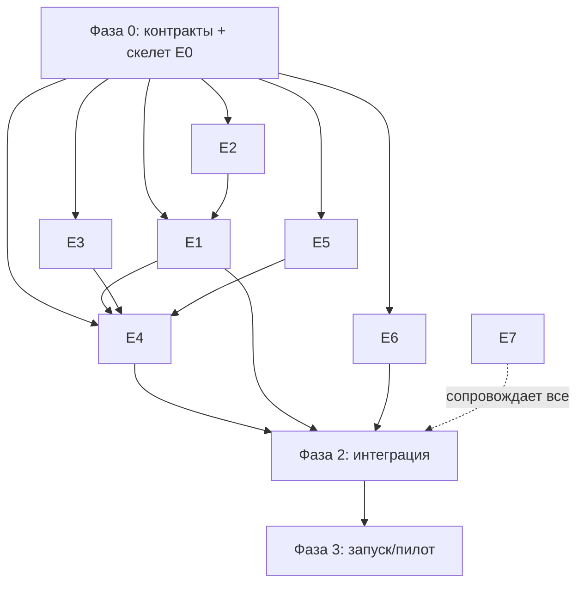

# 04. План параллельного выполнения

## Идея параллелизма

1. **Фаза 0 (синхронизация контрактов)** — короткая, выполняется до распараллеливания: команда фиксирует
   архитектуру ([`02-architecture.md`](02-architecture.md)) и контракты ([`03-interfaces.md`](03-interfaces.md)),
   а E0 готовит репозиторий-скелет, Docker Compose, моки границ.
2. **Фаза 1 (параллельная разработка)** — каждый эпик разрабатывается независимым агентом против
   зафиксированных контрактов и моков.
3. **Фаза 2 (интеграция)** — замена моков на реальные сервисы, сквозные сценарии, нагрузочное/контрактное тестирование.
4. **Фаза 3 (запуск)** — staging → prod, пилот на реальных лидах, настройка дашбордов и алертов.

## Распределение по агентам (рекомендация)

| Агент | Эпики | Навыки |
|-------|-------|--------|
| Agent A — Platform/DevOps | E0, частично E7 | Docker, CI, PostgreSQL, сеть/секреты |
| Agent B — AI/LLM | E1, E2 | Go, LLM API, prompt-engineering, RAG, Vector DB |
| Agent C — Channels | E3 | Go (net/http), Webhooks, Telegram/WhatsApp API |
| Agent D — Orchestration | E4 | n8n, бизнес-логика воронки |
| Agent E — Integrations | E5 | CRM API, маппинг данных |
| Agent F — Analytics | E6 | SQL, дашборды, моделирование событий |
| Agent G — QA/Sec | E7 | Тесты, наблюдаемость, безопасность |

> Минимальный состав — 1 агент может вести 2–3 эпика последовательно; контракты позволяют менять состав.

## Граф зависимостей

Ключевые зависимости:
- **E1 (LLM)** функционально опирается на **E2 (RAG)**, но может стартовать сразу на `mock-rag`.
- **E4 (n8n)** соединяет E1/E3/E5, поэтому интегрируется позже, но каркас воркфлоу можно строить на моках.
- **E6 (аналитика)** зависит только от схемы событий — стартует сразу на сгенерированных данных.
- **E7 (QA/Sec)** идёт параллельно всем эпикам.

## Контрольные точки (milestones) под модель оплаты заказчика

Каждый milestone = измеримый результат, проходящий тесты (соответствует Back-to-Back Milestone Payments).

| ID | Milestone | Зависит от | Критерий приёмки |
|----|-----------|-----------|------------------|
| M0 | Скелет платформы + контракты + моки запускаются `docker compose up` | — | Все сервисы-моки поднимаются, healthchecks зелёные |
| M1 | LLM Gateway отвечает по API с управлением промптами | M0 | `POST /v1/chat` возвращает ответ, версии промптов работают, учёт токенов |
| M2 | RAG: индексирует базу знаний и возвращает релевантные фрагменты | M0 | На тестовом наборе recall@5 ≥ целевого, `search` стабилен |
| M3 | Telegram-бот отвечает по базе знаний 24/7 | M1, M2 | Реальный диалог в Telegram, ответы из KB, эскалация работает |
| M4 | WhatsApp-бот отвечает по базе знаний | M1, M2, доступ к WA | Реальный диалог в WhatsApp |
| M5 | n8n: автоматизация воронки (квалификация, задачи, напоминания) | M3 | Заданные сценарии отрабатывают автоматически |
| M6 | Интеграция с CRM (лиды/сделки/задачи синхронизируются) | M5 | Лид из чата создаётся в CRM, статусы обновляются |
| M7 | Аналитический дашборд KPI | M0 + события | Дашборд показывает TTFR, воронку, automation rate |
| M8 | Пилот на проде + наблюдаемость/алерты | M3–M7 | Боевой пилот на реальных лидах, алерты настроены |

## Definition of Done (общий для эпиков)

- Контракты из [`03-interfaces.md`](03-interfaces.md) соблюдены (или изменены через PR).
- Код в Docker, поднимается локально одной командой.
- Тесты (unit + контрактные) проходят в CI.
- README эпика: как запустить, переменные окружения, примеры.
- События пишутся в `events` (для аналитики).
- Секреты вынесены в `.env`, нет утечек в репозиторий.

## Риски и снятие

| Риск | Влияние | Снятие |
|------|---------|--------|
| Долгое получение доступа к WhatsApp Business API | Блок M4 | Начать с Telegram (M3), параллельно вести верификацию WA |
| Не выбрана/нет доступа к CRM | Блок M6 | Разработка против `mock-crm` по адаптерному интерфейсу |
| Качество RAG-ответов ниже цели | Риск целей | Набор оценочных вопросов, итеративная калибровка промптов |
| Стоимость LLM | Бюджет | Маршрутизация моделей (дешёвая по умолчанию), кэш, лимиты |
| PII/комплаенс КГ | Юридический | Уточнить требования, минимизировать хранение, шифрование |
| Дубли/потеря вебхуков | Потеря лидов | Идемпотентность, ретраи, dead-letter, мониторинг |
